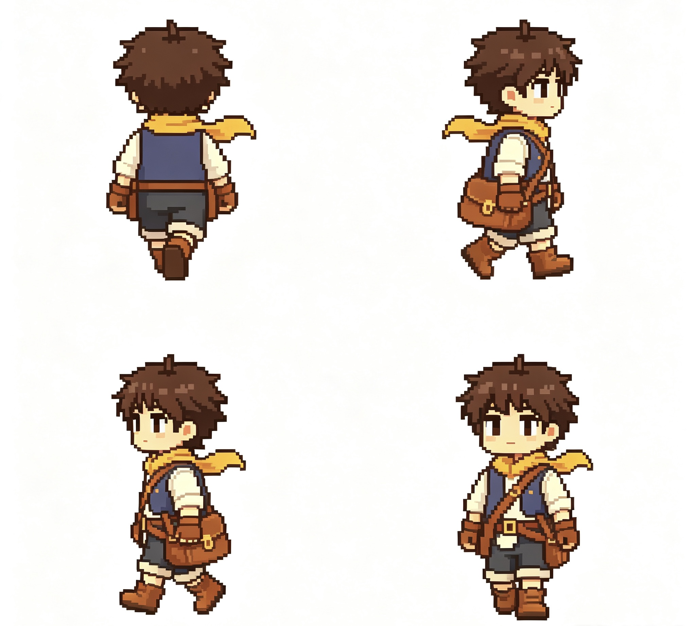

# Game_text

> 《小信使》（独立游戏）

《小信使》是一款 2D 像素手绘风格的独立游戏，讲述云落镇的治愈怀旧故事：零打怪、零惊悚、零战斗，核心玩法为场景解谜、线索搜集、多分支剧情抉择与 NPC 羁绊养成。

## 游戏特色

- 🖌️ 2D 像素手绘风格
- 🏡 云落镇治愈怀旧叙事
- 🚫 零打怪 · 零惊悚 · 零战斗
- 🧩 场景解谜、线索搜集
- 🎭 多分支剧情抉择
- 💞 NPC 羁绊养成

## 截图预览

